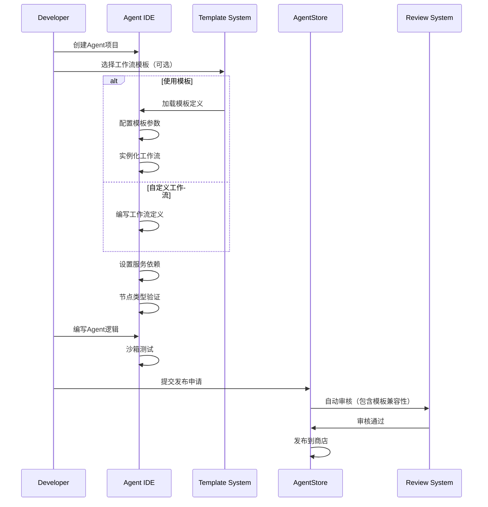
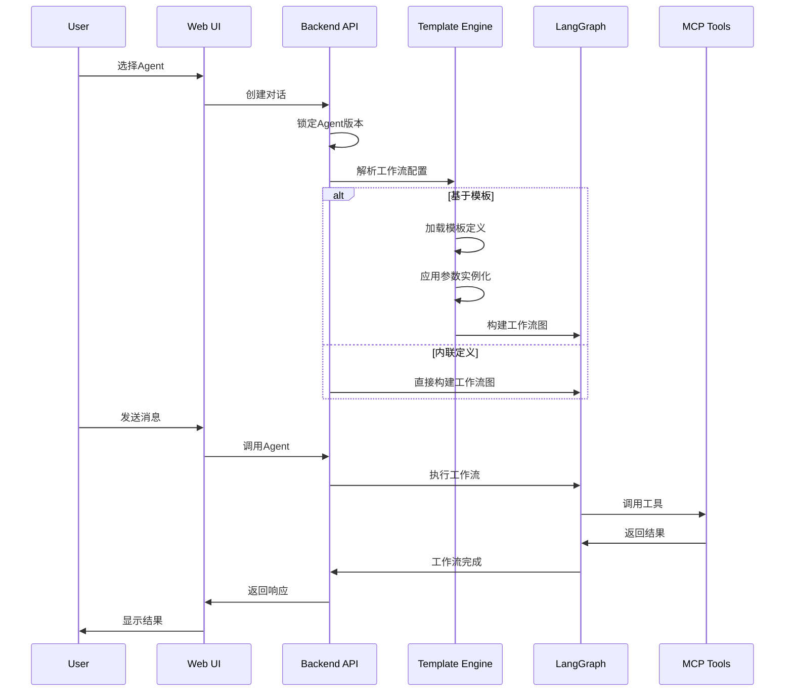
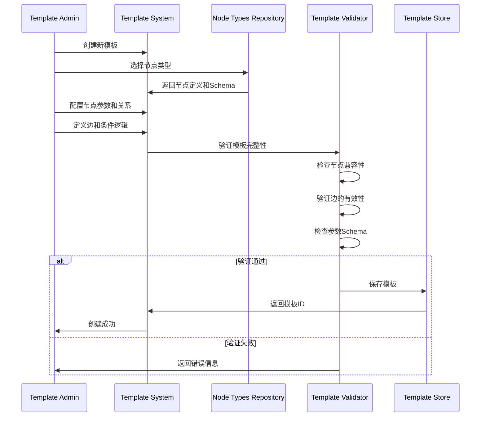
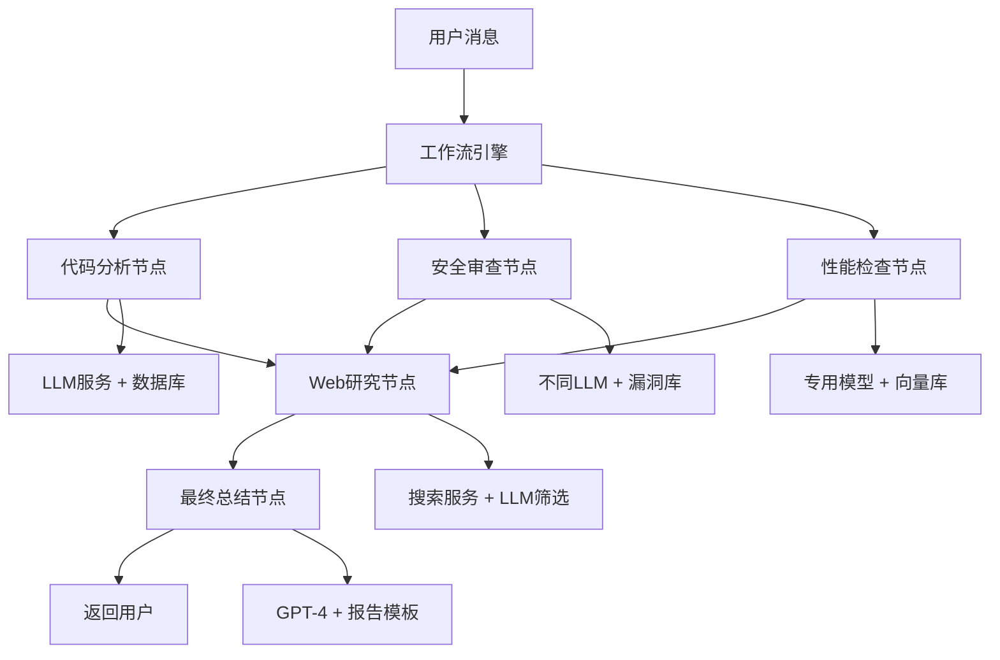

# 多用户Agent开发和使用系统 - 系统设计

## 1. 整体架构设计

### 1.1 系统架构概览

基于现有MaaS系统的DDD架构，采用微服务设计模式：

```
┌─────────────────────────────────────────────────┐
│                 Web Frontend                    │
│              (Vue 3 + Element Plus)             │
├─────────────────────────────────────────────────┤
│                API Gateway                      │
│            (FastAPI + Middleware)               │
├─────────────────────────────────────────────────┤
│  Agent    │ AgentStore │   Chat   │ Integration │
│  Module   │   Module   │  Module  │   Module    │
├─────────────────────────────────────────────────┤
│         Shared Infrastructure Layer             │
│       (Database, Cache, Auth, Logging)          │
├─────────────────────────────────────────────────┤
│          External Services                      │
│    (LLM APIs, MCP Tools, Vector DB, Search)     │
└─────────────────────────────────────────────────┘
```

### 1.2 技术栈选择

**后端技术栈：**
- **编程语言**: Python 3.11+
- **Web框架**: FastAPI (现有框架)
- **ORM框架**: SQLAlchemy 2.0 (现有)
- **数据库**: PostgreSQL (主数据库)
- **缓存**: Redis (会话存储和缓存)
- **向量数据库**: Milvus (RAG知识系统)
- **任务队列**: Celery (异步任务处理)
- **包管理**: uv (现有)

**前端技术栈：**
- **框架**: Vue 3 + Composition API
- **UI库**: Element Plus
- **语言**: TypeScript
- **构建工具**: Vite (rolldown-vite)
- **路由**: Vue Router 4
- **状态管理**: Pinia 3

**AI与工作流技术栈：**
- **工作流引擎**: LangGraph (状态管理和工作流编排)
- **AI框架**: LangChain (模型抽象和工具链)
- **工具协议**: FastMCP (Client-Server架构)
- **流式通信**: HTTP Streaming (替代SSE)

## 2. 核心模块设计

### 2.1 Agent模块 (src/agent/)

基于DDD分层结构设计：

```
src/agent/
├── domain/
│   ├── models/
│   │   ├── agent.py          # Agent聚合根
│   │   ├── template.py       # Agent模板实体
│   │   └── workflow.py       # LangGraph工作流
│   ├── repositories/
│   │   └── agent_repository.py
│   └── services/
│       ├── agent_service.py
│       └── version_service.py
├── application/
│   ├── agent_service.py        # Agent应用服务
│   ├── agentstore_service.py   # AgentStore服务
│   ├── chat_service.py         # 对话服务
│   ├── development_service.py  # 开发环境服务
│   └── schemas.py
├── infrastructure/
│   ├── repositories.py      # Agent仓储实现
│   ├── sandbox.py           # 代码执行沙箱
│   └── storage.py           # Agent代码存储
└── interface/
    ├── agent_controller.py       # Agent API控制器
    ├── agentstore_controllerpy   # AgentStore API控制器
│   ├── chat_scontroller.py       # 对话 API控制器
```

**核心领域模型：**

```python
class Agent(AggregateRoot):
    """Agent聚合根"""
    def __init__(self, id: UUID, name: str, description: str, 
                 developer_id: UUID, workflow: LangGraphWorkflow):
        self.id = id
        self.name = name
        self.description = description
        self.developer_id = developer_id
        self.workflow = workflow
        self.version = "1.0.0"
        self.status = AgentStatus.DRAFT
        self.service_dependencies = {}
        self.tool_dependencies = []
        self.rag_enabled = False
```

### 2.2 AgentStore模块

**核心功能实现：**

```python
class AgentStoreService:
    """AgentStore应用服务"""

    async def publish_agent(self, agent_id: UUID, developer_id: UUID):
        """发布Agent到商店"""

    async def search_agents(self, query: str, filters: dict):
        """搜索Agent"""

    async def get_recommendations(self, user_id: UUID):
        """获取推荐Agent"""
```

### 2.3 Chat模块

基于现有chat_controller扩展：

```python
class ChatService:
    """对话服务"""

    async def create_chat(self, user_id: UUID, agent_id: UUID):
        """创建新对话（自动锁定Agent版本）"""

    async def send_message(self, chat_id: UUID, message: str):
        """发送消息并获取回复"""

    async def get_chat_history(self, chat_id: UUID):
        """获取对话历史"""
```

**LangGraph集成：**

```python
class AgentExecutionGraph:
    """Agent执行图"""

    def __init__(self, agent_version: AgentVersion):
        self.graph = StateGraph(ChatState)
        self._build_graph(agent_version.workflow_definition)

    async def execute(self, message: str, context: dict):
        """执行Agent工作流"""
        return await self.graph.ainvoke({
            "messages": [message],
            "context": context
        })
```

### 2.4 Integration模块 (src/integration/)

**MCP工具集成（FastMCP Client-Server架构）：**

```python
# 客户端：MCP工具CRUD管理
class IntegratedMCPToolManager:
    """集成的MCP工具管理器 - 桥接Agent系统与MCP服务器"""
    
    def __init__(self, mcp_server_url: str):
        self.client = MCPStreamClient(mcp_server_url)
    
    async def prepare_agent_tools(self, agent_version_id: str, tool_dependencies: List[str]):
        """为Agent准备工具环境、创建Topic服务器"""
        
    async def call_agent_tool(self, agent_version_id: str, tool_name: str, parameters: dict):
        """调用Agent工具的统一接口"""
        
    async def call_agent_tool_stream(self, agent_version_id: str, tool_name: str, parameters: dict):
        """流式调用Agent工具"""

```


## 3. 数据库设计详述

### 3.1 Agent相关表设计

#### 3.1.1 Agent分类表
```sql
CREATE TABLE agent_categories (
    id UUID PRIMARY KEY,
    name VARCHAR(100) NOT NULL,
    parent_id UUID REFERENCES agent_categories(id),
    description TEXT,
    created_at TIMESTAMP DEFAULT CURRENT_TIMESTAMP
);
```

#### 3.1.2 Agent表（基于版本设计）
```sql
CREATE TABLE agents (
    id UUID PRIMARY KEY,
    name VARCHAR(255) NOT NULL,
    description TEXT,
    developer_id UUID REFERENCES users(id),
    category_id UUID REFERENCES agent_categories(id),
    tags TEXT[], -- Agent标签数组
    status VARCHAR(50) DEFAULT 'draft', -- 'draft', 'published', 'archived'
    download_count INTEGER DEFAULT 0,
    average_rating DECIMAL(3,2),
    latest_version VARCHAR(50),
    published_at TIMESTAMP,
    created_at TIMESTAMP DEFAULT CURRENT_TIMESTAMP,
    updated_at TIMESTAMP DEFAULT CURRENT_TIMESTAMP
);
```

#### 3.1.3 Agent版本表（支持Multi-Agent工作流和模板化）
```sql
CREATE TABLE agent_versions (
    id UUID PRIMARY KEY,
    agent_id UUID REFERENCES agents(id) ON DELETE CASCADE,
    version VARCHAR(50) NOT NULL,
    
    -- 🚀 基于节点的服务依赖配置（支持Multi-Agent工作流）
    service_dependencies JSONB NOT NULL DEFAULT '{}', 
    -- 格式：{"node_name": {"service_type": config_id, ...}, ...}
    
    model_params_override JSONB,        -- 可选的模型参数覆盖
    
    -- 🎯 工作流定义方式（二选一）
    workflow_definition JSONB,          -- 自定义工作流逻辑（内联方式）
    workflow_template_id UUID REFERENCES workflow_templates(id), -- 基于模板方式
    template_parameters JSONB,          -- 模板参数实例化值
    
    system_prompt TEXT,                 -- 系统提示词
    tool_dependencies TEXT[],           -- 工具依赖列表
    
    rag_enabled BOOLEAN DEFAULT FALSE,  -- RAG功能开关
    
    -- 版本管理
    changelog TEXT,                     -- 版本变更说明
    created_at TIMESTAMP DEFAULT CURRENT_TIMESTAMP,
    updated_at TIMESTAMP DEFAULT CURRENT_TIMESTAMP,
    
    -- 约束：workflow_definition和workflow_template_id二选一
    CONSTRAINT check_workflow_source CHECK (
        (workflow_definition IS NOT NULL AND workflow_template_id IS NULL) OR
        (workflow_definition IS NULL AND workflow_template_id IS NOT NULL)
    ),
    CONSTRAINT unique_current_version UNIQUE (agent_id) WHERE is_current = TRUE
);
```

#### 3.1.4 用户Agent使用记录表
```sql
CREATE TABLE agent_usage (
    id UUID PRIMARY KEY,
    user_id UUID REFERENCES users(id),
    agent_id UUID REFERENCES agents(id),
    first_used_at TIMESTAMP DEFAULT CURRENT_TIMESTAMP,
    last_used_at TIMESTAMP DEFAULT CURRENT_TIMESTAMP,
    usage_count INTEGER DEFAULT 1,
    UNIQUE(user_id, agent_id)
);
```

### 3.2 聊天相关表设计

#### 3.2.1 聊天会话表（版本锁定优化版）
```sql
CREATE TABLE chats (
    id UUID PRIMARY KEY,
    user_id UUID REFERENCES users(id),
    agent_id UUID REFERENCES agents(id),
    agent_version_id UUID REFERENCES agent_versions(id), -- 锁定使用的Agent版本
    title VARCHAR(255),
    context JSONB,
    status VARCHAR(50) DEFAULT 'active', -- 'active', 'archived', 'deleted'
    expires_at TIMESTAMP,
    created_at TIMESTAMP DEFAULT CURRENT_TIMESTAMP,
    updated_at TIMESTAMP DEFAULT CURRENT_TIMESTAMP
);
```

#### 3.2.2 聊天消息表（集成LangGraph工作流支持）
```sql
CREATE TABLE chat_messages (
    id UUID PRIMARY KEY,
    chat_id UUID REFERENCES chats(id),
    parent_message_id UUID REFERENCES chat_messages(id),
    role VARCHAR(50), -- 'user' or 'assistant'
    content TEXT,
    status VARCHAR(50) DEFAULT 'sent', -- 'sending', 'sent', 'failed', 'deleted'
    metadata JSONB,
    
    -- 🚀 LangGraph工作流集成字段
    workflow_execution_id UUID,                     -- 关联工作流执行ID
    workflow_node_name VARCHAR(128),                -- 产生此消息的工作流节点
    workflow_status VARCHAR(32) DEFAULT 'completed', -- 工作流状态
    message_type VARCHAR(32) DEFAULT 'text',        -- 消息类型：text, progress, error, system
    is_intermediate BOOLEAN DEFAULT FALSE,          -- 是否为中间进度消息（可清理）
    
    created_at TIMESTAMP DEFAULT CURRENT_TIMESTAMP
);
```

#### 3.2.3 工作流执行跟踪表
```sql
CREATE TABLE workflow_executions (
    id UUID PRIMARY KEY,
    chat_id UUID NOT NULL REFERENCES chats(id) ON DELETE CASCADE,
    message_id UUID REFERENCES chat_messages(id) ON DELETE CASCADE,
    agent_version_id UUID NOT NULL REFERENCES agent_versions(id),
    
    -- LangGraph检查点集成
    thread_id VARCHAR(255) NOT NULL,              -- 对应LangGraph的thread_id
    checkpoint_id VARCHAR(255),                   -- 当前检查点ID
    checkpointer_schema VARCHAR(64) DEFAULT 'langgraph',
    
    -- 执行状态
    status VARCHAR(32) NOT NULL DEFAULT 'running',
    current_node VARCHAR(128),                     -- 当前执行的工作流节点
    
    -- 执行结果和错误
    final_result JSONB,                           -- 最终执行结果
    error_info JSONB,                             -- 错误详细信息
    
    -- 性能统计
    total_nodes INTEGER DEFAULT 0,
    completed_nodes INTEGER DEFAULT 0,
    failed_nodes INTEGER DEFAULT 0,
    
    -- 时间戳
    started_at TIMESTAMP DEFAULT CURRENT_TIMESTAMP,
    completed_at TIMESTAMP,
    paused_at TIMESTAMP,                          -- 暂停时间（人工干预）
    
    UNIQUE (chat_id, thread_id)
);
```

### 3.3 统一服务配置系统

#### 3.3.1 服务供应商表（扩展现有providers表）
```sql
CREATE TABLE providers (
    provider_id INTEGER PRIMARY KEY AUTOINCREMENT,
    provider_name VARCHAR(64) NOT NULL,
    display_name VARCHAR(128) NOT NULL,
    service_type VARCHAR(50) NOT NULL DEFAULT 'llm',  -- 服务类型
    description TEXT,
    
    -- 配置项定义（基于依赖倒置原则）
    config_schema JSONB NOT NULL,                   -- 配置项JSON Schema定义
    auth_type VARCHAR(50) DEFAULT 'api_key',        -- 认证类型：api_key, oauth, basic等
    
    is_active BOOLEAN NOT NULL DEFAULT 1,
    created_by VARCHAR(64) NOT NULL,
    created_at DATETIME NOT NULL DEFAULT CURRENT_TIMESTAMP,
    updated_by VARCHAR(64) NOT NULL,
    updated_at DATETIME NOT NULL DEFAULT CURRENT_TIMESTAMP,
    is_delete BOOLEAN NOT NULL DEFAULT 0
);
-- 服务类型：'llm', 'search', 'code_executor', 'database', 'storage', 'api_service', 'vector_db'

-- 配置schema示例（基于JSON Schema格式）：
-- OpenAI: {"type":"object","properties":{"api_key":{"type":"string","encrypted":true,"required":true},"model":{"type":"string","enum":["gpt-4","gpt-3.5-turbo"]},"temperature":{"type":"number","min":0,"max":2}}}
-- PostgreSQL: {"type":"object","properties":{"host":{"type":"string","required":true},"port":{"type":"integer","default":5432},"username":{"type":"string","required":true},"password":{"type":"string","encrypted":true,"required":true},"database":{"type":"string","required":true}}}
```

#### 3.3.2 统一服务配置表
```sql
CREATE TABLE service_configs (
    config_id INTEGER PRIMARY KEY AUTOINCREMENT,
    provider_id INTEGER NOT NULL,
    service_name VARCHAR(128) NOT NULL,
    service_display_name VARCHAR(128) NOT NULL,
    
    -- 配置数据（基于provider的config_schema）
    config_data JSONB NOT NULL,                 -- 根据provider.config_schema填充的配置数据
    credentials TEXT,                           -- 加密认证信息
    
    -- 配置验证状态
    validation_status VARCHAR(20) DEFAULT 'pending', -- pending, valid, invalid
    validation_errors JSONB,                    -- 验证错误详情
    last_validated_at DATETIME,
    
    pricing_config JSONB,                       -- 定价配置
    limits_config JSONB,                        -- 使用限制配置
    is_active BOOLEAN NOT NULL DEFAULT 1,
    created_by VARCHAR(64) NOT NULL,
    created_at DATETIME NOT NULL DEFAULT CURRENT_TIMESTAMP,
    updated_by VARCHAR(64) NOT NULL,
    updated_at DATETIME NOT NULL DEFAULT CURRENT_TIMESTAMP,
    is_delete BOOLEAN NOT NULL DEFAULT 0,
    
    FOREIGN KEY (provider_id) REFERENCES providers(provider_id),
    UNIQUE (provider_id, service_name, is_delete)
);
```

#### 3.3.3 配置管理设计说明

**基于依赖倒置原则的配置管理架构：**

1. **providers表定义配置契约**：每个provider通过`config_schema`字段定义其需要的配置项、类型、验证规则等
2. **service_configs表提供配置实现**：根据provider的schema提供具体的配置值
3. **自动验证和加密**：系统根据schema自动验证配置合法性，并对标记为`encrypted`的字段进行加密
4. **动态UI生成**：前端可根据schema动态生成配置表单

**配置使用流程：**
- Agent创建时选择服务类型和provider
- 系统根据provider.config_schema生成配置表单
- 用户填写配置，系统自动验证和加密
- Agent执行时根据配置ID获取解密后的配置

### 3.4 Workflow模板化相关表设计

#### 3.4.1 Node类型定义表
```sql
CREATE TABLE node_types (
    id UUID PRIMARY KEY,
    type_name VARCHAR(64) NOT NULL UNIQUE,  -- 如：llm_processor, search_processor
    display_name VARCHAR(128) NOT NULL,     -- 显示名称
    description TEXT,                       -- 类型描述
    
    -- 验证和配置
    input_schema JSONB NOT NULL,           -- 输入参数JSON Schema
    output_schema JSONB NOT NULL,          -- 输出参数JSON Schema
    required_services TEXT[] NOT NULL,     -- 必需的服务类型
    default_config JSONB,                  -- 默认配置
    
    -- 分类和标签
    category VARCHAR(50),                  -- 分类：processing, io, control, integration
    tags TEXT[],                          -- 标签
    
    is_active BOOLEAN DEFAULT TRUE,
    created_at TIMESTAMP DEFAULT CURRENT_TIMESTAMP,
    updated_at TIMESTAMP DEFAULT CURRENT_TIMESTAMP
);
```

#### 3.4.2 Workflow模板表
```sql
CREATE TABLE workflow_templates (
    id UUID PRIMARY KEY,
    name VARCHAR(255) NOT NULL,
    display_name VARCHAR(255) NOT NULL,
    description TEXT,
    category VARCHAR(100),                 -- 分类：代码审查、内容生成、数据分析等
    
    -- 模板定义
    template_definition JSONB NOT NULL,   -- 标准化的workflow结构
    parameter_schema JSONB,               -- 参数化配置schema
    
    -- 使用统计
    usage_count INTEGER DEFAULT 0,
    average_rating DECIMAL(3,2),
    
    -- 版本和状态
    version VARCHAR(50) DEFAULT '1.0.0',
    status VARCHAR(50) DEFAULT 'active',  -- active, deprecated, draft
    
    created_by UUID REFERENCES users(id),
    created_at TIMESTAMP DEFAULT CURRENT_TIMESTAMP,
    updated_at TIMESTAMP DEFAULT CURRENT_TIMESTAMP
);
```

#### 3.4.3 模板中的Node定义表
```sql
CREATE TABLE workflow_template_nodes (
    id UUID PRIMARY KEY,
    template_id UUID REFERENCES workflow_templates(id) ON DELETE CASCADE,
    node_name VARCHAR(128) NOT NULL,
    node_type_id UUID REFERENCES node_types(id),
    
    -- Node配置
    node_config JSONB NOT NULL,           -- 节点具体配置
    position_config JSONB,               -- UI位置信息
    
    -- 关系定义
    parent_nodes TEXT[],                  -- 父节点列表
    child_nodes TEXT[],                   -- 子节点列表
    
    created_at TIMESTAMP DEFAULT CURRENT_TIMESTAMP,
    UNIQUE(template_id, node_name)
);
```

#### 3.4.4 模板边定义表（高级功能）
```sql
CREATE TABLE workflow_template_edges (
    id UUID PRIMARY KEY,
    template_id UUID REFERENCES workflow_templates(id) ON DELETE CASCADE,
    
    -- 边的基本信息
    from_node VARCHAR(128) NOT NULL,
    to_node VARCHAR(128),                    -- NULL表示动态目标
    edge_type VARCHAR(50) DEFAULT 'normal',  -- normal, conditional, fanout
    
    -- 条件边配置
    condition_function TEXT,                 -- 条件函数名或表达式
    condition_mapping JSONB,                 -- 条件到目标的映射
    -- 例如：{"true": "node_b", "false": "node_c"}
    
    -- 扇出边配置  
    fanout_targets TEXT[],                   -- 并行执行的目标节点列表
    fanout_condition JSONB,                  -- 扇出条件逻辑
    
    -- 执行策略
    execution_order INTEGER DEFAULT 0,
    timeout_seconds INTEGER,
    retry_policy JSONB,
    
    created_at TIMESTAMP DEFAULT CURRENT_TIMESTAMP,
    
    -- 约束
    FOREIGN KEY (template_id, from_node) REFERENCES workflow_template_nodes(template_id, node_name),
    
    -- 根据边类型的约束
    CHECK (
        (edge_type = 'normal' AND to_node IS NOT NULL AND condition_function IS NULL) OR
        (edge_type = 'conditional' AND condition_function IS NOT NULL) OR  
        (edge_type = 'fanout' AND fanout_targets IS NOT NULL)
    )
);
```

### 3.5 MCP工具相关表设计

#### 3.5.1 MCP工具注册表
```sql
CREATE TABLE mcp_tools (
    id UUID PRIMARY KEY,
    name VARCHAR(255) NOT NULL,
    version VARCHAR(50),
    description TEXT,
    tool_type VARCHAR(50) NOT NULL,                 -- 工具类型：http_api, code_tool, database, system
    manifest JSONB NOT NULL,                        -- 工具接口清单和配置
    
    server_endpoint VARCHAR(512),                   -- MCP服务器端点
    topic_server_id VARCHAR(255),                   -- 所属Topic服务器ID
    
    status VARCHAR(50) DEFAULT 'active',            -- 'active', 'inactive', 'deprecated'
    tags TEXT[],                                     -- 工具标签数组
    
    -- FastMCP集成字段
    is_streaming_supported BOOLEAN DEFAULT FALSE,   -- 是否支持流式调用
    max_execution_time INTEGER DEFAULT 300,         -- 最大执行时间（秒）
    resource_requirements JSONB,                    -- 资源需求配置
    
    created_at TIMESTAMP DEFAULT CURRENT_TIMESTAMP,
    updated_at TIMESTAMP DEFAULT CURRENT_TIMESTAMP,
    
    FOREIGN KEY (topic_server_id) REFERENCES mcp_topic_servers(server_id) ON DELETE CASCADE,
    UNIQUE(name, topic_server_id)
);
```

#### 3.5.2 MCP服务器状态表
```sql
CREATE TABLE mcp_topic_servers (
    id UUID PRIMARY KEY,
    server_id VARCHAR(255) NOT NULL UNIQUE,         -- Topic服务器标识
    name VARCHAR(255) NOT NULL,
    description TEXT,
    
    agent_version_id UUID,                          -- 关联的Agent版本
    
    -- 服务配置
    endpoint_url VARCHAR(512) NOT NULL,
    status VARCHAR(50) DEFAULT 'active',
    tool_count INTEGER DEFAULT 0,
    
    -- 性能统计
    total_calls INTEGER DEFAULT 0,
    success_calls INTEGER DEFAULT 0,
    average_response_time DECIMAL(10,3),
    
    created_at TIMESTAMP DEFAULT CURRENT_TIMESTAMP,
    updated_at TIMESTAMP DEFAULT CURRENT_TIMESTAMP,
    last_health_check TIMESTAMP,
    
    FOREIGN KEY (agent_version_id) REFERENCES agent_versions(id) ON DELETE CASCADE
);
```

### 3.5 数据库视图和索引优化

#### 3.5.1 当前Agent配置视图
```sql
CREATE VIEW current_agent_configs AS
SELECT 
    -- Agent基础信息
    a.id, a.name, a.description, a.developer_id, a.category_id, a.tags,
    a.status, a.download_count, a.average_rating, a.published_at,
    a.created_at as agent_created_at, a.updated_at as agent_updated_at,
    
    -- Agent版本信息
    av.id as version_id, av.version, av.workflow_definition, av.system_prompt,
    av.tool_dependencies, av.service_dependencies, av.rag_enabled,
    av.model_params_override, av.changelog, av.created_at as version_created_at
FROM agents a
JOIN agent_versions av ON a.id = av.agent_id 
WHERE av.is_current = TRUE;
```

#### 3.5.2 核心索引设计
```sql
-- Agent相关索引
CREATE INDEX idx_agents_category ON agents(category_id);
CREATE INDEX idx_agents_status ON agents(status);
CREATE INDEX idx_agents_developer ON agents(developer_id);
CREATE INDEX idx_agents_tags ON agents USING gin(tags);
CREATE INDEX idx_agent_versions_agent ON agent_versions(agent_id);
CREATE INDEX idx_agent_versions_current ON agent_versions(agent_id) WHERE is_current = TRUE;

-- 聊天相关索引
CREATE INDEX idx_chats_user ON chats(user_id);
CREATE INDEX idx_chats_agent_version ON chats(agent_version_id);
CREATE INDEX idx_chat_messages_chat ON chat_messages(chat_id);
CREATE INDEX idx_chat_messages_workflow ON chat_messages(workflow_execution_id);

-- 工作流相关索引
CREATE INDEX idx_workflow_executions_chat ON workflow_executions(chat_id);
CREATE INDEX idx_workflow_executions_status ON workflow_executions(status);
CREATE INDEX idx_workflow_executions_thread ON workflow_executions(thread_id);

-- JSONB字段索引
CREATE INDEX idx_agent_versions_workflow ON agent_versions USING gin(workflow_definition);
CREATE INDEX idx_agent_versions_service_deps ON agent_versions USING gin(service_dependencies);
CREATE INDEX idx_service_configs_data ON service_configs USING gin(config_data);
```

## 4. 流程设计

### 4.1 Agent开发流程（支持工作流模板）



### 4.2 用户使用Agent流程（支持模板化工作流）



### 4.3 工作流模板创建和管理流程



### 4.4 Multi-Agent工作流执行流程



## 5. 接口设计

### 5.1 Agent开发API

```python
@router.post("/agents")
async def create_agent(agent_data: AgentCreateSchema):
    """创建Agent"""

@router.put("/agents/{agent_id}/workflow")
async def update_workflow(agent_id: UUID, workflow: WorkflowUpdateSchema):
    """更新Agent工作流（支持模板或内联定义）"""

@router.post("/agents/{agent_id}/workflow/from-template")
async def create_workflow_from_template(
    agent_id: UUID, 
    template_data: WorkflowFromTemplateSchema
):
    """基于模板创建Agent工作流"""

@router.get("/agents/{agent_id}/workflow/validate")
async def validate_workflow(agent_id: UUID):
    """验证Agent工作流配置"""

@router.post("/agents/{agent_id}/test")
async def test_agent(agent_id: UUID, test_input: str):
    """测试Agent"""

@router.post("/agents/{agent_id}/publish")
async def publish_agent(agent_id: UUID):
    """发布Agent到商店"""
```

### 5.2 Workflow模板API

```python
@router.get("/workflow-templates")
async def search_templates(
    q: str = None, 
    category: str = None,
    node_type: str = None,
    complexity: str = None
):
    """搜索工作流模板"""

@router.get("/workflow-templates/{template_id}")
async def get_template_details(template_id: UUID):
    """获取模板详情"""

@router.post("/workflow-templates")
async def create_template(template_data: TemplateCreateSchema):
    """创建工作流模板"""

@router.put("/workflow-templates/{template_id}")
async def update_template(template_id: UUID, template_data: TemplateUpdateSchema):
    """更新工作流模板"""

@router.delete("/workflow-templates/{template_id}")
async def delete_template(template_id: UUID):
    """删除工作流模板"""

@router.post("/workflow-templates/{template_id}/validate")
async def validate_template(template_id: UUID):
    """验证工作流模板"""

@router.post("/workflow-templates/{template_id}/instantiate")
async def instantiate_template(template_id: UUID, parameters: TemplateParametersSchema):
    """实例化模板为具体工作流"""

@router.get("/workflow-templates/{template_id}/preview")
async def preview_template_instance(template_id: UUID, parameters: TemplateParametersSchema):
    """预览模板实例化结果"""

@router.get("/workflow-templates/{template_id}/usage-stats")
async def get_template_usage_stats(template_id: UUID):
    """获取模板使用统计"""
```

### 5.3 节点类型管理API

```python
@router.get("/node-types")
async def list_node_types(category: str = None):
    """列出可用的节点类型"""

@router.get("/node-types/{type_name}")
async def get_node_type(type_name: str):
    """获取节点类型详细信息"""

@router.post("/node-types")
async def create_node_type(node_type_data: NodeTypeCreateSchema):
    """创建新的节点类型"""

@router.put("/node-types/{type_name}")
async def update_node_type(type_name: str, node_type_data: NodeTypeUpdateSchema):
    """更新节点类型定义"""

@router.post("/node-types/{type_name}/validate-config")
async def validate_node_config(type_name: str, config: dict):
    """验证节点配置是否符合类型要求"""
```

### 5.4 AgentStore API

```python
@router.get("/store/agents")
async def search_agents(q: str, category: str = None):
    """搜索Agent"""

@router.get("/store/agents/{agent_id}")
async def get_agent_details(agent_id: UUID):
    """获取Agent详情"""

@router.post("/store/agents/{agent_id}/install")
async def install_agent(agent_id: UUID):
    """安装Agent"""
```

### 5.5 对话API（零配置体验）

```python
@router.post("/chats")
async def create_chat(agent_id: UUID):
    """零配置创建对话 - 自动使用平台服务配置"""

@router.post("/chats/{chat_id}/messages")
async def send_message(chat_id: UUID, message: str):
    """发送消息 - 自动应用Agent配置和平台服务设置"""

@router.get("/chats/{chat_id}/messages")
async def get_messages(chat_id: UUID):
    """获取对话历史"""
```

## 6. 安全设计

### 6.1 数据安全

- **API密钥加密存储**：使用国密SM4算法加密所有API密钥
- **数据传输加密**：HTTPS/TLS 1.3加密传输
- **数据库加密**：敏感字段加密存储
- **访问控制**：基于JWT的身份认证和RBAC权限控制

### 6.2 代码执行安全

- **沙箱环境**：Agent代码在Docker容器中隔离执行
- **资源限制**：内存、CPU、执行时间限制
- **网络隔离**：限制Agent访问外部网络
- **代码审核**：发布前自动安全扫描

### 6.3 MCP工具安全

- **工具沙箱**：独立的MCP服务器环境
- **权限控制**：用户授权Agent使用特定工具
- **调用监控**：完整的工具调用日志和审计
- **资源限制**：工具执行时间和资源限制

## 7. 性能设计

### 7.1 数据库性能优化

- **索引策略**：为高频查询字段建立合适索引
- **分区策略**：对大数据量表进行时间分区
- **查询优化**：使用视图简化复杂查询
- **连接池**：数据库连接池优化

### 7.2 缓存策略

- **Redis缓存**：Agent配置、用户会话缓存
- **应用缓存**：热门Agent和搜索结果缓存
- **CDN加速**：静态资源和API响应缓存

### 7.3 并发处理

- **异步处理**：使用async/await处理并发请求
- **消息队列**：Celery处理长时间任务
- **负载均衡**：支持水平扩展和负载分发

## 8. 监控与运维

### 8.1 系统监控

- **应用监控**：APM工具监控应用性能
- **基础设施监控**：服务器资源监控
- **业务监控**：Agent使用统计和性能监控

### 8.2 日志管理

- **结构化日志**：使用loguru记录结构化日志
- **日志聚合**：ELK Stack日志收集和分析
- **审计日志**：完整的用户操作审计记录

### 8.3 告警机制

- **实时告警**：系统异常实时告警
- **性能告警**：性能指标阈值告警
- **业务告警**：业务指标异常告警

## 9. 部署架构

### 9.1 容器化部署

- **Docker容器**：所有服务容器化部署
- **Kubernetes编排**：使用K8s管理容器编排
- **微服务拆分**：按模块拆分为独立服务

### 9.2 CI/CD流程

- **代码管理**：Git版本控制和分支管理
- **自动化测试**：单元测试、集成测试自动化
- **自动部署**：GitOps工作流自动部署

### 9.3 环境管理

- **开发环境**：本地开发和测试环境
- **测试环境**：集成测试和用户验收测试
- **生产环境**：高可用生产环境