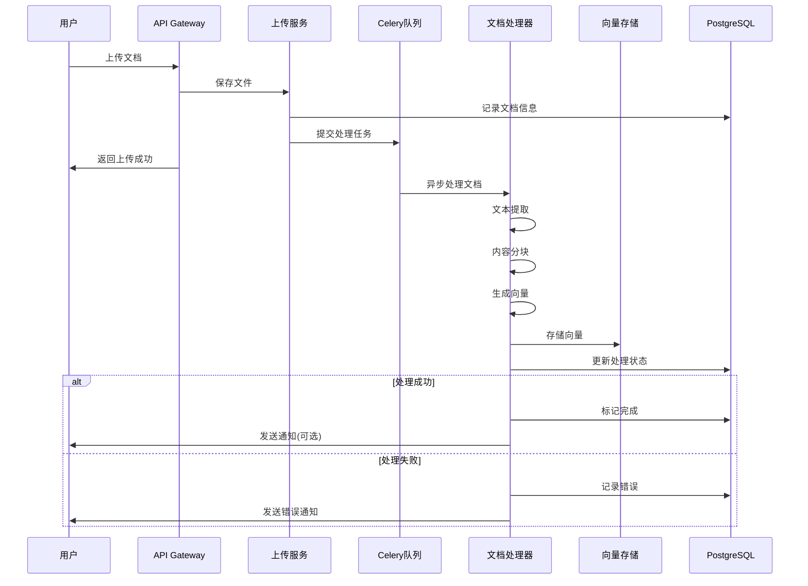
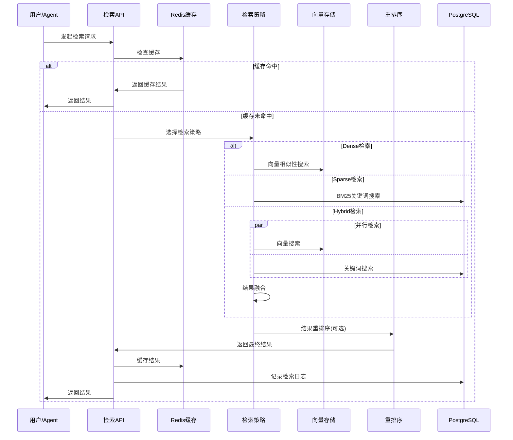
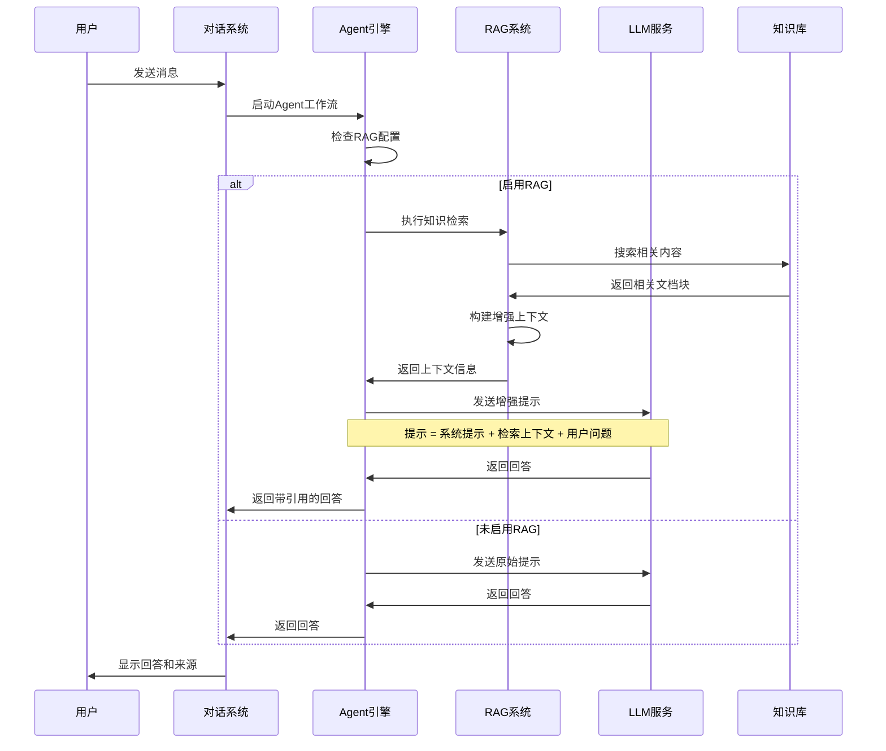

# MaaS平台RAG系统 - 系统设计

## 1. 整体架构设计

### 1.1 系统架构概览

基于现有MaaS系统的DDD架构，采用微服务设计模式，集成RAG知识检索能力：

```
┌─────────────────────────────────────────────────┐
│                 Web Frontend                    │
│              (Vue 3 + Element Plus)            │
├─────────────────────────────────────────────────┤
│                API Gateway                      │
│            (FastAPI + Middleware)              │
├─────────────────────────────────────────────────┤
│Knowledge  │Intelligence │ Vector   │ LangGraph │
│Management │ Retrieval   │ Storage  │Integration│
│  Module   │   Module    │ Module   │  Module   │
├─────────────────────────────────────────────────┤
│         Document Processing Layer               │
│    (Parsing, Chunking, Embedding, Index)      │
├─────────────────────────────────────────────────┤
│         Shared Infrastructure Layer             │
│  (PostgreSQL, Milvus, Redis, Celery, Auth)    │
├─────────────────────────────────────────────────┤
│          External Services                      │
│ (Embedding APIs, LLM APIs, File Storage)      │
└─────────────────────────────────────────────────┘
```

### 1.2 技术栈选择

**后端技术栈：**
- **编程语言**: Python 3.11+ (现有技术栈)
- **Web框架**: FastAPI (现有框架)
- **ORM框架**: SQLAlchemy 2.0 (现有)
- **关系数据库**: PostgreSQL (元数据存储)
- **向量数据库**: Milvus + pgvector (向量存储和检索)
- **缓存**: Redis (检索缓存和会话存储)
- **任务队列**: Celery (异步文档处理)
- **包管理**: uv (现有)

**AI与检索技术栈：**
- **工作流引擎**: LangGraph (现有工作流系统)
- **Embedding模型**: 多模型支持 (OpenAI、BGE、M3E)
- **检索策略**: 多策略融合 (Dense、Sparse、Hybrid)
- **文档处理**: PyPDF2、python-docx、BeautifulSoup
- **向量检索**: Milvus + pgvector (主备架构)

### 1.3 架构特点

**高可用性设计：**
- 微服务架构，独立部署和扩展
- 多层缓存策略，提升响应性能
- 容灾备份机制，保证数据安全
- 监控告警体系，及时发现问题

**性能优化设计：**
- 异步处理架构，支持高并发
- 分层索引策略，优化检索速度
- 智能缓存机制，减少重复计算
- 资源池管理，提高资源利用率

## 2. 核心模块设计

### 2.1 知识库管理模块 (src/rag/knowledge/)

基于DDD分层结构设计：

```
src/rag/knowledge/
├── domain/
│   ├── models/
│   │   ├── knowledge_base.py      # 知识库聚合根
│   │   ├── document.py            # 文档实体
│   │   ├── chunk.py              # 文档分块实体
│   │   └── category.py           # 分类值对象
│   ├── repositories/
│   │   ├── knowledge_repository.py
│   │   └── document_repository.py
│   └── services/
│       ├── knowledge_service.py
│       └── permission_service.py
├── application/
│   ├── knowledge_service.py       # 知识库应用服务
│   ├── document_service.py        # 文档应用服务
│   └── schemas.py                 # 应用数据模型
├── infrastructure/
│   ├── repositories.py            # 仓储实现
│   ├── storage.py                # 文件存储适配器
│   └── processors.py             # 文档处理器
└── interface/
    └── knowledge_controller.py    # 知识库API控制器
```

**核心领域模型：**

```python
from dataclasses import dataclass
from typing import List, Optional
from uuid import UUID
from enum import Enum

class KnowledgeBaseStatus(Enum):
    DRAFT = "draft"
    PROCESSING = "processing"
    ACTIVE = "active"
    ARCHIVED = "archived"

@dataclass
class KnowledgeBase:
    """知识库聚合根"""
    id: UUID
    name: str
    description: Optional[str]
    owner_id: UUID
    category: str
    status: KnowledgeBaseStatus
    embedding_model: str
    chunk_size: int
    chunk_overlap: int
    retrieval_config: dict
    documents: List['Document']
    created_at: datetime
    updated_at: datetime
    
    def add_document(self, document: 'Document'):
        """添加文档到知识库"""
        
    def update_retrieval_config(self, config: dict):
        """更新检索配置"""
        
    def is_accessible_by(self, user_id: UUID) -> bool:
        """检查用户访问权限"""

@dataclass 
class Document:
    """文档实体"""
    id: UUID
    knowledge_base_id: UUID
    filename: str
    file_path: str
    content_type: str
    size: int
    status: str  # processing, completed, failed
    chunks: List['Chunk']
    metadata: dict
    created_at: datetime
    
    def chunk_content(self, chunk_size: int, overlap: int) -> List['Chunk']:
        """文档分块处理"""
```

### 2.2 智能检索模块 (src/rag/retrieval/)

**多策略检索引擎设计：**

```python
from abc import ABC, abstractmethod
from typing import List, Dict, Any

class RetrievalStrategy(ABC):
    """检索策略抽象基类"""
    
    @abstractmethod
    async def retrieve(self, query: str, kb_id: UUID, top_k: int) -> List[dict]:
        """检索相关文档"""
        
class DenseRetrievalStrategy(RetrievalStrategy):
    """向量语义检索策略"""
    
    def __init__(self, vector_store: VectorStore, embedding_model: EmbeddingModel):
        self.vector_store = vector_store
        self.embedding_model = embedding_model
    
    async def retrieve(self, query: str, kb_id: UUID, top_k: int) -> List[dict]:
        # 1. 查询向量化
        query_vector = await self.embedding_model.encode(query)
        # 2. 向量检索
        results = await self.vector_store.search(
            collection_name=f"kb_{kb_id}",
            vector=query_vector,
            limit=top_k
        )
        return results

class SparseRetrievalStrategy(RetrievalStrategy):
    """稀疏关键词检索策略(BM25)"""
    
    async def retrieve(self, query: str, kb_id: UUID, top_k: int) -> List[dict]:
        # BM25关键词检索实现
        pass

class HybridRetrievalStrategy(RetrievalStrategy):
    """混合检索策略"""
    
    def __init__(self, dense_strategy: DenseRetrievalStrategy, 
                 sparse_strategy: SparseRetrievalStrategy,
                 fusion_weight: float = 0.7):
        self.dense_strategy = dense_strategy
        self.sparse_strategy = sparse_strategy
        self.fusion_weight = fusion_weight
    
    async def retrieve(self, query: str, kb_id: UUID, top_k: int) -> List[dict]:
        # 1. 并行执行两种检索
        dense_results = await self.dense_strategy.retrieve(query, kb_id, top_k * 2)
        sparse_results = await self.sparse_strategy.retrieve(query, kb_id, top_k * 2)
        
        # 2. 结果融合和重排序
        fused_results = self._fuse_results(dense_results, sparse_results)
        return fused_results[:top_k]

class IntelligentRetrievalService:
    """智能检索服务"""
    
    def __init__(self):
        self.strategies = {
            'dense': DenseRetrievalStrategy(),
            'sparse': SparseRetrievalStrategy(), 
            'hybrid': HybridRetrievalStrategy()
        }
        self.cache = CacheManager()
    
    async def retrieve(self, query: str, kb_id: UUID, strategy: str = 'hybrid', 
                      top_k: int = 5) -> List[dict]:
        """智能检索入口"""
        # 1. 缓存检查
        cache_key = f"retrieve:{kb_id}:{hash(query)}:{strategy}:{top_k}"
        cached_result = await self.cache.get(cache_key)
        if cached_result:
            return cached_result
            
        # 2. 执行检索
        retrieval_strategy = self.strategies[strategy]
        results = await retrieval_strategy.retrieve(query, kb_id, top_k)
        
        # 3. 结果后处理
        processed_results = await self._post_process_results(results, query)
        
        # 4. 缓存结果
        await self.cache.set(cache_key, processed_results, ttl=300)
        
        return processed_results
```

### 2.3 向量存储管理模块 (src/rag/vector/)

**Milvus + pgvector双引擎设计：**

```python
import asyncio
from typing import List, Dict, Any, Optional, Union
from pymilvus import Collection, connections, utility
import asyncpg
import numpy as np
from abc import ABC, abstractmethod

class VectorStoreInterface(ABC):
    """向量存储接口"""
    
    @abstractmethod
    async def create_collection(self, kb_id: UUID, dimension: int) -> None:
        """创建向量集合"""
        
    @abstractmethod
    async def insert_vectors(self, kb_id: UUID, vectors_data: List[Dict]) -> None:
        """插入向量数据"""
        
    @abstractmethod 
    async def search_vectors(self, kb_id: UUID, query_vector: List[float], 
                           top_k: int, filter_expr: str = None) -> List[dict]:
        """向量检索"""

class MilvusVectorStore(VectorStoreInterface):
    """Milvus向量存储管理器（主引擎）"""
    
    def __init__(self, host: str, port: int, db_name: str = "rag_vectors"):
        self.host = host
        self.port = port  
        self.db_name = db_name
        self.collections: Dict[str, Collection] = {}
        
    async def create_collection(self, kb_id: UUID, dimension: int = 1536) -> None:
        """为知识库创建向量集合"""
        collection_name = f"kb_{kb_id}"
        
        # 1. 定义集合结构
        schema = {
            "fields": [
                {"name": "id", "type": "int64", "is_primary": True, "auto_id": True},
                {"name": "chunk_id", "type": "varchar", "max_length": 36},
                {"name": "document_id", "type": "varchar", "max_length": 36},
                {"name": "content", "type": "varchar", "max_length": 65535},
                {"name": "vector", "type": "float_vector", "dim": dimension},
                {"name": "metadata", "type": "json"}
            ]
        }
        
        # 2. 创建集合
        collection = await self._create_collection_with_schema(collection_name, schema)
        
        # 3. 创建HNSW索引
        await self._create_vector_index(collection, "HNSW")
        
        self.collections[collection_name] = collection
        
    async def insert_vectors(self, kb_id: UUID, vectors_data: List[Dict[str, Any]]):
        """批量插入向量数据"""
        collection_name = f"kb_{kb_id}"
        collection = self.collections.get(collection_name)
        
        if not collection:
            raise ValueError(f"Collection {collection_name} not found")
            
        # 批量插入优化
        batch_size = 1000
        for i in range(0, len(vectors_data), batch_size):
            batch_data = vectors_data[i:i + batch_size]
            await collection.insert(batch_data)
            await collection.flush()
    
    async def search_vectors(self, kb_id: UUID, query_vector: List[float], 
                           top_k: int = 10, filter_expr: str = None) -> List[dict]:
        """向量相似性搜索"""
        collection_name = f"kb_{kb_id}"
        collection = self.collections.get(collection_name)
        
        search_params = {
            "metric_type": "IP",  # 内积相似度
            "params": {"ef": 64}  # HNSW参数
        }
        
        results = await collection.search(
            data=[query_vector],
            anns_field="vector", 
            param=search_params,
            limit=top_k,
            expr=filter_expr,
            output_fields=["chunk_id", "document_id", "content", "metadata"]
        )
        
        return self._format_search_results(results)

class PgVectorStore(VectorStoreInterface):
    """PostgreSQL pgvector向量存储管理器（备用引擎）"""
    
    def __init__(self, connection_string: str):
        self.connection_string = connection_string
        self.pool = None
        
    async def initialize(self):
        """初始化连接池"""
        self.pool = await asyncpg.create_pool(self.connection_string)
        
        # 确保pgvector扩展已安装
        async with self.pool.acquire() as conn:
            await conn.execute("CREATE EXTENSION IF NOT EXISTS vector")
    
    async def create_collection(self, kb_id: UUID, dimension: int = 1536) -> None:
        """创建向量表"""
        table_name = f"vectors_kb_{kb_id.hex}"
        
        async with self.pool.acquire() as conn:
            await conn.execute(f"""
                CREATE TABLE IF NOT EXISTS {table_name} (
                    id BIGSERIAL PRIMARY KEY,
                    chunk_id UUID NOT NULL,
                    document_id UUID NOT NULL,
                    content TEXT NOT NULL,
                    vector vector({dimension}) NOT NULL,
                    metadata JSONB,
                    created_at TIMESTAMP DEFAULT CURRENT_TIMESTAMP
                );
                
                -- 创建向量索引(HNSW)
                CREATE INDEX IF NOT EXISTS {table_name}_vector_idx 
                ON {table_name} USING hnsw (vector vector_ip_ops)
                WITH (m = 16, ef_construction = 64);
                
                -- 创建其他索引
                CREATE INDEX IF NOT EXISTS {table_name}_chunk_id_idx ON {table_name}(chunk_id);
                CREATE INDEX IF NOT EXISTS {table_name}_document_id_idx ON {table_name}(document_id);
            """)
    
    async def insert_vectors(self, kb_id: UUID, vectors_data: List[Dict[str, Any]]):
        """批量插入向量数据"""
        table_name = f"vectors_kb_{kb_id.hex}"
        
        async with self.pool.acquire() as conn:
            # 准备批量插入数据
            insert_data = []
            for item in vectors_data:
                insert_data.append((
                    item['chunk_id'],
                    item['document_id'], 
                    item['content'],
                    item['vector'],
                    item.get('metadata', {})
                ))
            
            # 批量插入
            await conn.executemany(f"""
                INSERT INTO {table_name} (chunk_id, document_id, content, vector, metadata)
                VALUES ($1, $2, $3, $4, $5)
            """, insert_data)
    
    async def search_vectors(self, kb_id: UUID, query_vector: List[float], 
                           top_k: int = 10, filter_expr: str = None) -> List[dict]:
        """向量相似性搜索"""
        table_name = f"vectors_kb_{kb_id.hex}"
        
        # 构建查询SQL
        base_query = f"""
            SELECT chunk_id, document_id, content, metadata,
                   1 - (vector <=> $1) as similarity_score
            FROM {table_name}
        """
        
        where_clause = ""
        params = [query_vector]
        
        if filter_expr:
            where_clause = f" WHERE {filter_expr}"
        
        query = f"{base_query}{where_clause} ORDER BY vector <=> $1 LIMIT {top_k}"
        
        async with self.pool.acquire() as conn:
            rows = await conn.fetch(query, *params)
            
            return [
                {
                    "chunk_id": str(row['chunk_id']),
                    "document_id": str(row['document_id']),
                    "content": row['content'],
                    "metadata": row['metadata'],
                    "score": float(row['similarity_score'])
                }
                for row in rows
            ]

class HybridVectorStore:
    """混合向量存储管理器（主备架构）"""
    
    def __init__(self, primary_store: VectorStoreInterface, 
                 backup_store: VectorStoreInterface):
        self.primary_store = primary_store
        self.backup_store = backup_store
        self.use_backup = False
        
    async def create_collection(self, kb_id: UUID, dimension: int = 1536) -> None:
        """同时在主备存储中创建集合"""
        try:
            await self.primary_store.create_collection(kb_id, dimension)
            await self.backup_store.create_collection(kb_id, dimension)
        except Exception as e:
            logger.error(f"Failed to create collection in primary store: {e}")
            # 如果主存储失败，只创建备份存储
            await self.backup_store.create_collection(kb_id, dimension)
            self.use_backup = True
    
    async def insert_vectors(self, kb_id: UUID, vectors_data: List[Dict[str, Any]]):
        """双写模式插入向量数据"""
        tasks = []
        
        if not self.use_backup:
            tasks.append(self.primary_store.insert_vectors(kb_id, vectors_data))
        
        tasks.append(self.backup_store.insert_vectors(kb_id, vectors_data))
        
        # 并行执行插入
        try:
            await asyncio.gather(*tasks, return_exceptions=True)
        except Exception as e:
            logger.error(f"Vector insertion error: {e}")
            # 如果主存储失败，切换到备份存储
            self.use_backup = True
    
    async def search_vectors(self, kb_id: UUID, query_vector: List[float], 
                           top_k: int = 10, filter_expr: str = None) -> List[dict]:
        """智能向量检索（主备切换）"""
        try:
            if not self.use_backup:
                # 尝试使用主存储
                return await self.primary_store.search_vectors(
                    kb_id, query_vector, top_k, filter_expr
                )
        except Exception as e:
            logger.warning(f"Primary store search failed: {e}, switching to backup")
            self.use_backup = True
        
        # 使用备份存储
        return await self.backup_store.search_vectors(
            kb_id, query_vector, top_k, filter_expr
        )

class EmbeddingModelManager:
    """Embedding模型管理器"""
    
    def __init__(self):
        self.models = {}
        self.current_model = None
        
    async def load_model(self, model_name: str, model_config: dict):
        """加载Embedding模型"""
        if model_name == "openai":
            from openai import AsyncOpenAI
            self.models[model_name] = AsyncOpenAI(api_key=model_config["api_key"])
        elif model_name == "bge":
            from sentence_transformers import SentenceTransformer
            self.models[model_name] = SentenceTransformer(model_config["model_path"])
        # 支持更多模型...
        
    async def encode_batch(self, texts: List[str], model_name: str = None) -> List[List[float]]:
        """批量文本向量化"""
        model = self.models.get(model_name or self.current_model)
        
        if not model:
            raise ValueError("No embedding model available")
            
        # 异步批量编码
        if hasattr(model, 'aencode'):
            return await model.aencode(texts)
        else:
            # 同步模型的异步包装
            loop = asyncio.get_event_loop()
            return await loop.run_in_executor(None, model.encode, texts)
```

### 2.4 LangGraph工作流集成模块 (src/rag/workflow/)

**RAG工作流节点设计：**

```python
from langgraph.graph import StateGraph, END
from typing import TypedDict, List, Annotated
import operator

class RAGState(TypedDict):
    """RAG工作流状态定义"""
    query: str
    knowledge_base_ids: List[str]
    retrieval_strategy: str
    retrieved_chunks: List[dict]
    context: str
    answer: str
    sources: List[dict]
    metadata: dict

class DocumentRetrievalNode:
    """文档检索节点"""
    
    def __init__(self, retrieval_service: IntelligentRetrievalService):
        self.retrieval_service = retrieval_service
    
    async def __call__(self, state: RAGState) -> RAGState:
        """执行文档检索"""
        query = state["query"]
        kb_ids = state["knowledge_base_ids"]
        strategy = state.get("retrieval_strategy", "hybrid")
        
        all_chunks = []
        for kb_id in kb_ids:
            chunks = await self.retrieval_service.retrieve(
                query=query,
                kb_id=UUID(kb_id),
                strategy=strategy,
                top_k=10
            )
            all_chunks.extend(chunks)
        
        # 去重和重排序
        unique_chunks = self._deduplicate_chunks(all_chunks)
        state["retrieved_chunks"] = unique_chunks[:20]  # 取前20个
        
        return state

class ContextAugmentationNode:
    """上下文增强节点"""
    
    async def __call__(self, state: RAGState) -> RAGState:
        """构建增强上下文"""
        chunks = state["retrieved_chunks"]
        
        # 1. 内容聚合
        context_parts = []
        sources = []
        
        for i, chunk in enumerate(chunks):
            context_parts.append(f"[{i+1}] {chunk['content']}")
            sources.append({
                "chunk_id": chunk["chunk_id"],
                "document_name": chunk["metadata"].get("filename"),
                "score": chunk["score"]
            })
        
        # 2. 上下文优化
        optimized_context = self._optimize_context("\n\n".join(context_parts))
        
        state["context"] = optimized_context
        state["sources"] = sources
        
        return state

class AnswerGenerationNode:
    """答案生成节点"""
    
    def __init__(self, llm_service):
        self.llm_service = llm_service
    
    async def __call__(self, state: RAGState) -> RAGState:
        """基于上下文生成答案"""
        query = state["query"]
        context = state["context"]
        
        prompt = f"""基于以下上下文信息回答问题。如果上下文中没有相关信息，请明确说明。

上下文信息：
{context}

问题：{query}

请提供准确、详细的回答，并在回答后标注信息来源："""
        
        answer = await self.llm_service.generate_response(prompt)
        state["answer"] = answer
        
        return state

class RAGWorkflowBuilder:
    """RAG工作流构建器"""
    
    def __init__(self, retrieval_service, llm_service):
        self.retrieval_service = retrieval_service
        self.llm_service = llm_service
    
    def build_rag_graph(self) -> StateGraph:
        """构建标准RAG工作流图"""
        
        # 创建节点
        retrieval_node = DocumentRetrievalNode(self.retrieval_service)
        context_node = ContextAugmentationNode()
        generation_node = AnswerGenerationNode(self.llm_service)
        
        # 构建工作流图
        workflow = StateGraph(RAGState)
        
        workflow.add_node("retrieve", retrieval_node)
        workflow.add_node("augment", context_node)
        workflow.add_node("generate", generation_node)
        
        workflow.add_edge("retrieve", "augment")
        workflow.add_edge("augment", "generate")
        workflow.add_edge("generate", END)
        
        workflow.set_entry_point("retrieve")
        
        return workflow.compile()

class MultiAgentRAGOrchestrator:
    """Multi-Agent RAG编排器"""
    
    def __init__(self):
        self.agent_pools = {}
        
    async def parallel_retrieval(self, query: str, kb_groups: List[List[str]]) -> List[dict]:
        """并行多Agent检索"""
        tasks = []
        
        for i, kb_group in enumerate(kb_groups):
            agent = f"retrieval_agent_{i}"
            task = self._create_retrieval_task(agent, query, kb_group)
            tasks.append(task)
        
        results = await asyncio.gather(*tasks)
        
        # 结果融合
        return self._fuse_multi_agent_results(results)
    
    async def cross_validation_retrieval(self, query: str, kb_ids: List[str]) -> List[dict]:
        """交叉验证检索"""
        # 使用不同策略的多个Agent进行检索
        strategies = ['dense', 'sparse', 'hybrid']
        tasks = []
        
        for strategy in strategies:
            task = self._retrieve_with_strategy(query, kb_ids, strategy)
            tasks.append(task)
        
        strategy_results = await asyncio.gather(*tasks)
        
        # 交叉验证和结果融合
        validated_results = self._cross_validate_results(strategy_results)
        return validated_results
```

## 3. 数据库设计详述

### 3.1 RAG核心表设计

#### 3.1.1 知识库表
```sql
CREATE TABLE knowledge_bases (
    id UUID PRIMARY KEY DEFAULT gen_random_uuid(),
    name VARCHAR(255) NOT NULL,
    display_name VARCHAR(255) NOT NULL,
    description TEXT,
    owner_id UUID REFERENCES users(id) NOT NULL,
    category VARCHAR(100) DEFAULT 'general',
    
    -- 向量化配置
    embedding_model VARCHAR(100) DEFAULT 'openai-text-embedding-3-small',
    embedding_dimension INTEGER DEFAULT 1536,
    chunk_size INTEGER DEFAULT 1000,
    chunk_overlap INTEGER DEFAULT 200,
    chunk_strategy VARCHAR(50) DEFAULT 'recursive',
    
    -- 检索配置
    retrieval_config JSONB DEFAULT '{}',
    -- 格式：{
    --   "default_strategy": "hybrid",
    --   "dense_weight": 0.7,
    --   "sparse_weight": 0.3,
    --   "rerank_enabled": true,
    --   "similarity_threshold": 0.7
    -- }
    
    -- 访问控制
    visibility VARCHAR(20) DEFAULT 'private', -- 'private', 'public', 'shared'
    access_permissions JSONB DEFAULT '[]',
    -- 格式：[{"user_id": "xxx", "role": "read"}, {"group_id": "xxx", "role": "write"}]
    
    -- 状态和统计
    status VARCHAR(20) DEFAULT 'draft', -- 'draft', 'processing', 'active', 'archived'
    document_count INTEGER DEFAULT 0,
    total_chunks INTEGER DEFAULT 0,
    storage_size BIGINT DEFAULT 0, -- bytes
    last_updated_at TIMESTAMP,
    
    created_at TIMESTAMP DEFAULT CURRENT_TIMESTAMP,
    updated_at TIMESTAMP DEFAULT CURRENT_TIMESTAMP,
    created_by UUID REFERENCES users(id),
    
    -- 约束
    CONSTRAINT check_chunk_size CHECK (chunk_size > 0 AND chunk_size <= 8000),
    CONSTRAINT check_chunk_overlap CHECK (chunk_overlap >= 0 AND chunk_overlap < chunk_size),
    CONSTRAINT check_embedding_dimension CHECK (embedding_dimension > 0)
);

-- 索引
CREATE INDEX idx_knowledge_bases_owner ON knowledge_bases(owner_id);
CREATE INDEX idx_knowledge_bases_status ON knowledge_bases(status);
CREATE INDEX idx_knowledge_bases_category ON knowledge_bases(category);
CREATE INDEX idx_knowledge_bases_visibility ON knowledge_bases(visibility);
CREATE INDEX idx_knowledge_bases_updated_at ON knowledge_bases(last_updated_at DESC);
```

#### 3.1.2 文档表
```sql
CREATE TABLE documents (
    id UUID PRIMARY KEY DEFAULT gen_random_uuid(),
    knowledge_base_id UUID REFERENCES knowledge_bases(id) ON DELETE CASCADE,
    filename VARCHAR(500) NOT NULL,
    original_filename VARCHAR(500) NOT NULL,
    file_path TEXT NOT NULL,
    file_url TEXT,
    
    -- 文件信息
    content_type VARCHAR(100) NOT NULL,
    file_size BIGINT NOT NULL,
    file_hash VARCHAR(64) NOT NULL, -- SHA-256哈希，用于去重
    encoding VARCHAR(50) DEFAULT 'utf-8',
    
    -- 处理状态
    status VARCHAR(20) DEFAULT 'uploaded', -- 'uploaded', 'processing', 'completed', 'failed'
    processing_started_at TIMESTAMP,
    processing_completed_at TIMESTAMP,
    error_message TEXT,
    
    -- 内容统计
    extracted_text_length INTEGER DEFAULT 0,
    chunk_count INTEGER DEFAULT 0,
    
    -- 文档元数据
    metadata JSONB DEFAULT '{}',
    -- 格式：{
    --   "author": "xxx",
    --   "title": "xxx", 
    --   "language": "zh-CN",
    --   "source": "upload|url|api",
    --   "tags": ["tag1", "tag2"],
    --   "custom_fields": {...}
    -- }
    
    -- 版本控制
    version INTEGER DEFAULT 1,
    parent_document_id UUID REFERENCES documents(id),
    
    created_at TIMESTAMP DEFAULT CURRENT_TIMESTAMP,
    updated_at TIMESTAMP DEFAULT CURRENT_TIMESTAMP,
    created_by UUID REFERENCES users(id),
    
    -- 约束
    UNIQUE(knowledge_base_id, file_hash), -- 同一知识库内防止重复上传
    CHECK (file_size > 0),
    CHECK (chunk_count >= 0)
);

-- 索引
CREATE INDEX idx_documents_kb_id ON documents(knowledge_base_id);
CREATE INDEX idx_documents_status ON documents(status);
CREATE INDEX idx_documents_hash ON documents(file_hash);
CREATE INDEX idx_documents_created_at ON documents(created_at DESC);
CREATE INDEX idx_documents_metadata ON documents USING gin(metadata);
```

#### 3.1.3 文档分块表
```sql
CREATE TABLE document_chunks (
    id UUID PRIMARY KEY DEFAULT gen_random_uuid(),
    document_id UUID REFERENCES documents(id) ON DELETE CASCADE,
    knowledge_base_id UUID REFERENCES knowledge_bases(id) ON DELETE CASCADE,
    
    -- 分块信息
    chunk_index INTEGER NOT NULL, -- 在文档中的序号
    content TEXT NOT NULL,
    content_length INTEGER NOT NULL,
    
    -- 位置信息
    start_char_index INTEGER,
    end_char_index INTEGER,
    page_number INTEGER,
    
    -- 向量信息
    embedding_status VARCHAR(20) DEFAULT 'pending', -- 'pending', 'processing', 'completed', 'failed'
    vector_id VARCHAR(100), -- 对应Milvus中的向量ID
    embedding_model VARCHAR(100),
    embedding_created_at TIMESTAMP,
    
    -- 分块元数据
    metadata JSONB DEFAULT '{}',
    -- 格式：{
    --   "section_title": "xxx",
    --   "section_level": 2,
    --   "table_content": true,
    --   "image_references": ["img1.png"],
    --   "processing_notes": "xxx"
    -- }
    
    created_at TIMESTAMP DEFAULT CURRENT_TIMESTAMP,
    updated_at TIMESTAMP DEFAULT CURRENT_TIMESTAMP,
    
    -- 约束
    UNIQUE(document_id, chunk_index),
    CHECK (content_length > 0),
    CHECK (chunk_index >= 0),
    CHECK (start_char_index >= 0),
    CHECK (end_char_index > start_char_index)
);

-- 索引
CREATE INDEX idx_chunks_document_id ON document_chunks(document_id);
CREATE INDEX idx_chunks_kb_id ON document_chunks(knowledge_base_id);
CREATE INDEX idx_chunks_status ON document_chunks(embedding_status);
CREATE INDEX idx_chunks_vector_id ON document_chunks(vector_id);
CREATE INDEX idx_chunks_content_length ON document_chunks(content_length);
CREATE INDEX idx_chunks_metadata ON document_chunks USING gin(metadata);

-- 全文搜索索引（用于稀疏检索）
CREATE INDEX idx_chunks_content_fts ON document_chunks USING gin(to_tsvector('english', content));
CREATE INDEX idx_chunks_content_fts_zh ON document_chunks USING gin(to_tsvector('zhcfg', content));
```

### 3.2 RAG应用集成表

#### 3.2.1 Agent-RAG配置表
```sql
CREATE TABLE agent_rag_configs (
    id UUID PRIMARY KEY DEFAULT gen_random_uuid(),
    agent_version_id UUID REFERENCES agent_versions(id) ON DELETE CASCADE,
    
    -- 知识库绑定
    knowledge_base_ids UUID[] NOT NULL DEFAULT '{}',
    default_knowledge_base_id UUID REFERENCES knowledge_bases(id),
    
    -- 检索配置
    retrieval_strategy VARCHAR(50) DEFAULT 'hybrid', -- 'dense', 'sparse', 'hybrid', 'graph'
    max_chunks INTEGER DEFAULT 10,
    similarity_threshold DECIMAL(3,2) DEFAULT 0.7,
    
    -- 策略权重配置
    strategy_weights JSONB DEFAULT '{"dense": 0.7, "sparse": 0.3}',
    
    -- 上下文配置
    max_context_length INTEGER DEFAULT 4000,
    context_template TEXT DEFAULT '基于以下信息回答问题:\n\n{context}\n\n问题: {query}',
    
    -- 缓存配置
    cache_enabled BOOLEAN DEFAULT TRUE,
    cache_ttl INTEGER DEFAULT 300, -- 缓存时间（秒）
    
    -- 质量控制
    enable_reranking BOOLEAN DEFAULT FALSE,
    enable_source_citation BOOLEAN DEFAULT TRUE,
    min_chunk_relevance DECIMAL(3,2) DEFAULT 0.5,
    
    is_active BOOLEAN DEFAULT TRUE,
    created_at TIMESTAMP DEFAULT CURRENT_TIMESTAMP,
    updated_at TIMESTAMP DEFAULT CURRENT_TIMESTAMP,
    
    -- 约束
    UNIQUE(agent_version_id),
    CHECK (max_chunks > 0 AND max_chunks <= 50),
    CHECK (similarity_threshold >= 0.0 AND similarity_threshold <= 1.0)
);

-- 索引
CREATE INDEX idx_agent_rag_configs_agent_version ON agent_rag_configs(agent_version_id);
CREATE INDEX idx_agent_rag_configs_kb_ids ON agent_rag_configs USING gin(knowledge_base_ids);
```

#### 3.2.2 检索历史记录表
```sql
CREATE TABLE retrieval_logs (
    id UUID PRIMARY KEY DEFAULT gen_random_uuid(),
    
    -- 检索上下文
    user_id UUID REFERENCES users(id),
    agent_version_id UUID REFERENCES agent_versions(id),
    conversation_id UUID REFERENCES chats(id),
    knowledge_base_id UUID REFERENCES knowledge_bases(id) NOT NULL,
    
    -- 检索查询
    query TEXT NOT NULL,
    query_hash VARCHAR(64) NOT NULL, -- 查询哈希，用于缓存
    retrieval_strategy VARCHAR(50) NOT NULL,
    
    -- 检索参数
    search_params JSONB DEFAULT '{}',
    -- 格式：{
    --   "top_k": 10,
    --   "similarity_threshold": 0.7,
    --   "filter_conditions": {...}
    -- }
    
    -- 检索结果
    result_count INTEGER NOT NULL DEFAULT 0,
    retrieved_chunks UUID[] DEFAULT '{}', -- 返回的chunk IDs
    
    -- 性能指标
    processing_time_ms INTEGER, -- 检索耗时（毫秒）
    vector_search_time_ms INTEGER,
    reranking_time_ms INTEGER,
    
    -- 质量指标
    avg_similarity_score DECIMAL(5,3),
    max_similarity_score DECIMAL(5,3),
    min_similarity_score DECIMAL(5,3),
    
    -- 缓存信息
    cache_hit BOOLEAN DEFAULT FALSE,
    cache_key VARCHAR(128),
    
    created_at TIMESTAMP DEFAULT CURRENT_TIMESTAMP,
    
    -- 约束
    CHECK (result_count >= 0),
    CHECK (processing_time_ms >= 0)
);

-- 索引
CREATE INDEX idx_retrieval_logs_user ON retrieval_logs(user_id);
CREATE INDEX idx_retrieval_logs_kb ON retrieval_logs(knowledge_base_id);
CREATE INDEX idx_retrieval_logs_query_hash ON retrieval_logs(query_hash);
CREATE INDEX idx_retrieval_logs_created_at ON retrieval_logs(created_at DESC);
CREATE INDEX idx_retrieval_logs_cache_key ON retrieval_logs(cache_key);
```

### 3.3 系统配置和统计表

#### 3.3.1 RAG系统配置表
```sql
CREATE TABLE rag_system_configs (
    id SERIAL PRIMARY KEY,
    config_key VARCHAR(100) NOT NULL UNIQUE,
    config_value JSONB NOT NULL,
    description TEXT,
    config_category VARCHAR(50) DEFAULT 'general',
    
    -- 配置约束
    is_encrypted BOOLEAN DEFAULT FALSE,
    is_required BOOLEAN DEFAULT FALSE,
    validation_schema JSONB,
    
    created_at TIMESTAMP DEFAULT CURRENT_TIMESTAMP,
    updated_at TIMESTAMP DEFAULT CURRENT_TIMESTAMP,
    updated_by UUID REFERENCES users(id)
);

-- 插入默认配置
INSERT INTO rag_system_configs (config_key, config_value, description, config_category) VALUES
('embedding_models', '{"default": "openai-text-embedding-3-small", "available": ["openai-text-embedding-3-small", "bge-base-zh", "m3e-base"]}', 'Available embedding models', 'embedding'),
('vector_stores', '{"primary": "milvus", "backup": "pgvector", "auto_failover": true}', 'Vector storage configuration', 'storage'),
('retrieval_defaults', '{"strategy": "hybrid", "top_k": 10, "similarity_threshold": 0.7}', 'Default retrieval parameters', 'retrieval'),
('chunking_defaults', '{"chunk_size": 1000, "chunk_overlap": 200, "strategy": "recursive"}', 'Default chunking parameters', 'processing'),
('performance_limits', '{"max_concurrent_embeddings": 100, "max_document_size_mb": 50, "max_kb_size_gb": 10}', 'System performance limits', 'performance');
```

#### 3.3.2 RAG使用统计表
```sql
CREATE TABLE rag_usage_stats (
    id UUID PRIMARY KEY DEFAULT gen_random_uuid(),
    
    -- 统计维度
    stat_date DATE NOT NULL,
    stat_type VARCHAR(50) NOT NULL, -- 'daily', 'hourly', 'monthly'
    
    -- 基础统计
    knowledge_base_id UUID REFERENCES knowledge_bases(id),
    user_id UUID REFERENCES users(id),
    agent_id UUID REFERENCES agents(id),
    
    -- 使用量统计
    retrieval_count INTEGER DEFAULT 0,
    total_documents_processed INTEGER DEFAULT 0,
    total_chunks_created INTEGER DEFAULT 0,
    total_vectors_stored INTEGER DEFAULT 0,
    
    -- 性能统计
    avg_retrieval_time_ms DECIMAL(10,2) DEFAULT 0,
    avg_embedding_time_ms DECIMAL(10,2) DEFAULT 0,
    
    -- 质量统计
    avg_similarity_score DECIMAL(5,3) DEFAULT 0,
    user_satisfaction_score DECIMAL(3,2),
    
    -- 资源消耗
    storage_used_bytes BIGINT DEFAULT 0,
    embedding_api_calls INTEGER DEFAULT 0,
    
    created_at TIMESTAMP DEFAULT CURRENT_TIMESTAMP,
    updated_at TIMESTAMP DEFAULT CURRENT_TIMESTAMP,
    
    -- 约束
    UNIQUE(stat_date, stat_type, knowledge_base_id, user_id, agent_id)
);

-- 索引
CREATE INDEX idx_rag_usage_stats_date ON rag_usage_stats(stat_date);
CREATE INDEX idx_rag_usage_stats_kb ON rag_usage_stats(knowledge_base_id);
CREATE INDEX idx_rag_usage_stats_user ON rag_usage_stats(user_id);
```

### 3.4 数据库视图和函数

#### 3.4.1 知识库概览视图
```sql
CREATE VIEW knowledge_base_overview AS
SELECT 
    kb.id,
    kb.name,
    kb.display_name,
    kb.description,
    kb.status,
    kb.visibility,
    kb.document_count,
    kb.total_chunks,
    kb.storage_size,
    kb.embedding_model,
    kb.created_at,
    kb.last_updated_at,
    
    -- 所有者信息
    u.username as owner_username,
    u.email as owner_email,
    
    -- 使用统计
    COALESCE(usage.retrieval_count, 0) as total_retrievals,
    COALESCE(usage.avg_similarity, 0) as avg_similarity_score,
    
    -- 最近文档
    recent_docs.recent_document_count
    
FROM knowledge_bases kb
LEFT JOIN users u ON kb.owner_id = u.id
LEFT JOIN (
    SELECT 
        knowledge_base_id,
        SUM(retrieval_count) as retrieval_count,
        AVG(avg_similarity_score) as avg_similarity
    FROM rag_usage_stats 
    WHERE stat_date >= CURRENT_DATE - INTERVAL '30 days'
    GROUP BY knowledge_base_id
) usage ON kb.id = usage.knowledge_base_id
LEFT JOIN (
    SELECT 
        knowledge_base_id,
        COUNT(*) as recent_document_count
    FROM documents
    WHERE created_at >= CURRENT_DATE - INTERVAL '7 days'
    GROUP BY knowledge_base_id
) recent_docs ON kb.id = recent_docs.knowledge_base_id;
```

#### 3.4.2 检索性能分析函数
```sql
CREATE OR REPLACE FUNCTION analyze_retrieval_performance(
    kb_id UUID,
    start_date TIMESTAMP DEFAULT CURRENT_TIMESTAMP - INTERVAL '7 days',
    end_date TIMESTAMP DEFAULT CURRENT_TIMESTAMP
) 
RETURNS TABLE (
    avg_processing_time DECIMAL,
    p95_processing_time DECIMAL,
    total_queries INTEGER,
    cache_hit_rate DECIMAL,
    avg_result_count DECIMAL,
    avg_similarity DECIMAL
) AS $$
BEGIN
    RETURN QUERY
    SELECT 
        AVG(rl.processing_time_ms)::DECIMAL,
        PERCENTILE_CONT(0.95) WITHIN GROUP (ORDER BY rl.processing_time_ms)::DECIMAL,
        COUNT(*)::INTEGER,
        (COUNT(*) FILTER (WHERE rl.cache_hit) * 100.0 / COUNT(*))::DECIMAL,
        AVG(rl.result_count)::DECIMAL,
        AVG(rl.avg_similarity_score)::DECIMAL
    FROM retrieval_logs rl
    WHERE rl.knowledge_base_id = kb_id
        AND rl.created_at BETWEEN start_date AND end_date;
END;
$$ LANGUAGE plpgsql;
```

## 4. 接口设计

### 4.1 知识库管理API

```python
from fastapi import APIRouter, Depends, UploadFile, File, BackgroundTasks
from typing import List, Optional
from src.rag.application.schemas import *

router = APIRouter(prefix="/rag/knowledge-bases", tags=["Knowledge Base"])

@router.post("/", response_model=KnowledgeBaseResponse)
async def create_knowledge_base(
    kb_data: KnowledgeBaseCreateSchema,
    current_user: User = Depends(get_current_user)
):
    """创建知识库"""
    pass

@router.get("/", response_model=List[KnowledgeBaseResponse])
async def list_knowledge_bases(
    category: Optional[str] = None,
    status: Optional[str] = None,
    visibility: Optional[str] = None,
    page: int = 1,
    size: int = 20,
    current_user: User = Depends(get_current_user)
):
    """获取知识库列表"""
    pass

@router.get("/{kb_id}", response_model=KnowledgeBaseDetailResponse)
async def get_knowledge_base(
    kb_id: UUID,
    current_user: User = Depends(get_current_user)
):
    """获取知识库详情"""
    pass

@router.put("/{kb_id}", response_model=KnowledgeBaseResponse)
async def update_knowledge_base(
    kb_id: UUID,
    kb_data: KnowledgeBaseUpdateSchema,
    current_user: User = Depends(get_current_user)
):
    """更新知识库"""
    pass

@router.delete("/{kb_id}")
async def delete_knowledge_base(
    kb_id: UUID,
    current_user: User = Depends(get_current_user)
):
    """删除知识库（软删除）"""
    pass

@router.post("/{kb_id}/documents/upload")
async def upload_documents(
    kb_id: UUID,
    background_tasks: BackgroundTasks,
    files: List[UploadFile] = File(...),
    metadata: Optional[str] = None,
    current_user: User = Depends(get_current_user)
):
    """批量上传文档"""
    pass

@router.get("/{kb_id}/documents", response_model=List[DocumentResponse])
async def list_documents(
    kb_id: UUID,
    status: Optional[str] = None,
    page: int = 1,
    size: int = 20,
    current_user: User = Depends(get_current_user)
):
    """获取文档列表"""
    pass

@router.delete("/{kb_id}/documents/{doc_id}")
async def delete_document(
    kb_id: UUID,
    doc_id: UUID,
    current_user: User = Depends(get_current_user)
):
    """删除文档"""
    pass

@router.post("/{kb_id}/rebuild")
async def rebuild_knowledge_base(
    kb_id: UUID,
    background_tasks: BackgroundTasks,
    current_user: User = Depends(get_current_user)
):
    """重建知识库（重新向量化）"""
    pass
```

### 4.2 智能检索API

```python
@router.post("/search", response_model=RetrievalResponse)
async def search_knowledge(
    search_request: RetrievalRequest,
    current_user: User = Depends(get_current_user)
):
    """智能知识检索"""
    pass

@router.post("/multi-search", response_model=List[RetrievalResponse])
async def multi_knowledge_search(
    search_request: MultiRetrievalRequest,
    current_user: User = Depends(get_current_user)
):
    """多知识库并行检索"""
    pass

@router.post("/similarity-search", response_model=SimilaritySearchResponse)
async def similarity_search(
    search_request: SimilaritySearchRequest,
    current_user: User = Depends(get_current_user)
):
    """相似内容检索"""
    pass

@router.get("/search/suggestions")
async def get_search_suggestions(
    kb_id: UUID,
    query: str,
    limit: int = 5,
    current_user: User = Depends(get_current_user)
):
    """搜索建议"""
    pass

@router.get("/search/history", response_model=List[SearchHistoryResponse])
async def get_search_history(
    kb_id: Optional[UUID] = None,
    limit: int = 20,
    current_user: User = Depends(get_current_user)
):
    """搜索历史"""
    pass
```

### 4.3 LangGraph RAG节点API

```python
@router.post("/workflow/retrieve")
async def workflow_retrieve_node(
    request: WorkflowRetrievalRequest
):
    """LangGraph工作流检索节点"""
    pass

@router.post("/workflow/augment")  
async def workflow_augment_node(
    request: WorkflowAugmentationRequest
):
    """LangGraph工作流上下文增强节点"""
    pass

@router.post("/workflow/generate")
async def workflow_generate_node(
    request: WorkflowGenerationRequest
):
    """LangGraph工作流答案生成节点"""
    pass

@router.get("/workflow/templates", response_model=List[RAGTemplateResponse])
async def list_rag_templates():
    """获取RAG工作流模板"""
    pass

@router.post("/workflow/templates", response_model=RAGTemplateResponse)
async def create_rag_template(
    template_data: RAGTemplateCreateSchema,
    current_user: User = Depends(get_current_user)
):
    """创建RAG工作流模板"""
    pass
```

### 4.4 Agent RAG集成API

```python
@router.get("/agents/{agent_id}/rag-config", response_model=AgentRAGConfigResponse)
async def get_agent_rag_config(
    agent_id: UUID,
    current_user: User = Depends(get_current_user)
):
    """获取Agent RAG配置"""
    pass

@router.put("/agents/{agent_id}/rag-config", response_model=AgentRAGConfigResponse)
async def update_agent_rag_config(
    agent_id: UUID,
    config_data: AgentRAGConfigUpdateSchema,
    current_user: User = Depends(get_current_user)
):
    """更新Agent RAG配置"""
    pass

@router.post("/agents/{agent_id}/rag-test")
async def test_agent_rag(
    agent_id: UUID,
    test_request: AgentRAGTestRequest,
    current_user: User = Depends(get_current_user)
):
    """测试Agent RAG功能"""
    pass

@router.get("/agents/{agent_id}/rag-analytics", response_model=RAGAnalyticsResponse)
async def get_agent_rag_analytics(
    agent_id: UUID,
    days: int = 7,
    current_user: User = Depends(get_current_user)
):
    """获取Agent RAG使用分析"""
    pass
```

### 4.5 数据结构定义

```python
from pydantic import BaseModel, Field
from typing import List, Optional, Dict, Any
from uuid import UUID
from datetime import datetime
from enum import Enum

# 知识库相关结构
class KnowledgeBaseCreateSchema(BaseModel):
    name: str = Field(..., min_length=1, max_length=255)
    display_name: str = Field(..., min_length=1, max_length=255)
    description: Optional[str] = None
    category: str = Field(default="general")
    embedding_model: str = Field(default="openai-text-embedding-3-small")
    chunk_size: int = Field(default=1000, ge=100, le=8000)
    chunk_overlap: int = Field(default=200, ge=0)
    retrieval_config: Optional[Dict[str, Any]] = None
    visibility: str = Field(default="private", regex="^(private|public|shared)$")

class KnowledgeBaseResponse(BaseModel):
    id: UUID
    name: str
    display_name: str
    description: Optional[str]
    category: str
    status: str
    visibility: str
    document_count: int
    total_chunks: int
    storage_size: int
    embedding_model: str
    created_at: datetime
    updated_at: datetime
    
    class Config:
        from_attributes = True

class KnowledgeBaseDetailResponse(KnowledgeBaseResponse):
    retrieval_config: Dict[str, Any]
    access_permissions: List[Dict[str, Any]]
    recent_documents: List['DocumentResponse']
    usage_stats: Dict[str, Any]

# 检索相关结构
class RetrievalRequest(BaseModel):
    query: str = Field(..., min_length=1)
    knowledge_base_ids: List[UUID]
    strategy: str = Field(default="hybrid", regex="^(dense|sparse|hybrid)$")
    top_k: int = Field(default=10, ge=1, le=50)
    similarity_threshold: float = Field(default=0.7, ge=0.0, le=1.0)
    include_metadata: bool = Field(default=True)
    filter_conditions: Optional[Dict[str, Any]] = None

class RetrievalChunk(BaseModel):
    chunk_id: UUID
    document_id: UUID
    content: str
    similarity_score: float
    metadata: Dict[str, Any]
    document_name: str
    page_number: Optional[int]

class RetrievalResponse(BaseModel):
    query: str
    strategy_used: str
    total_results: int
    processing_time_ms: int
    chunks: List[RetrievalChunk]
    cache_hit: bool
    knowledge_base_id: UUID

# Agent RAG配置结构
class AgentRAGConfigUpdateSchema(BaseModel):
    knowledge_base_ids: List[UUID]
    retrieval_strategy: str = Field(default="hybrid")
    max_chunks: int = Field(default=10, ge=1, le=50)
    similarity_threshold: float = Field(default=0.7, ge=0.0, le=1.0)
    context_template: Optional[str] = None
    enable_reranking: bool = Field(default=False)
    cache_enabled: bool = Field(default=True)

class AgentRAGConfigResponse(BaseModel):
    id: UUID
    agent_version_id: UUID
    knowledge_base_ids: List[UUID]
    retrieval_strategy: str
    max_chunks: int
    similarity_threshold: float
    context_template: str
    enable_reranking: bool
    cache_enabled: bool
    is_active: bool
    created_at: datetime
    updated_at: datetime
```

## 5. 流程设计

### 5.1 文档处理流程



### 5.2 智能检索流程



### 5.3 Agent RAG集成流程



## 6. 与现有系统集成设计

### 6.1 用户系统集成

**权限控制集成：**
```python
class RAGPermissionService:
    """RAG权限控制服务"""
    
    def __init__(self, rbac_service: RBACService):
        self.rbac_service = rbac_service
    
    async def check_knowledge_base_access(self, user_id: UUID, kb_id: UUID, 
                                        permission: str) -> bool:
        """检查用户对知识库的访问权限"""
        # 1. 检查知识库所有权
        kb = await self.get_knowledge_base(kb_id)
        if kb.owner_id == user_id:
            return True
        
        # 2. 检查共享权限
        if kb.visibility == "public":
            return permission in ["read", "search"]
        
        # 3. 检查用户组权限
        user_groups = await self.rbac_service.get_user_groups(user_id)
        for permission_entry in kb.access_permissions:
            if permission_entry.get("user_id") == str(user_id):
                return permission in permission_entry.get("permissions", [])
            if permission_entry.get("group_id") in [str(g.id) for g in user_groups]:
                return permission in permission_entry.get("permissions", [])
        
        return False
    
    async def filter_accessible_knowledge_bases(self, user_id: UUID, 
                                              kb_ids: List[UUID]) -> List[UUID]:
        """过滤用户可访问的知识库"""
        accessible_kbs = []
        for kb_id in kb_ids:
            if await self.check_knowledge_base_access(user_id, kb_id, "read"):
                accessible_kbs.append(kb_id)
        return accessible_kbs
```

### 6.2 Agent系统集成

**Agent配置系统集成：**
```python
class AgentRAGIntegrationService:
    """Agent RAG集成服务"""
    
    async def setup_agent_rag(self, agent_version_id: UUID, 
                            rag_config: AgentRAGConfigSchema) -> None:
        """为Agent版本配置RAG功能"""
        # 1. 验证知识库访问权限
        accessible_kbs = await self.permission_service.filter_accessible_knowledge_bases(
            rag_config.user_id, rag_config.knowledge_base_ids
        )
        
        if not accessible_kbs:
            raise PermissionError("No accessible knowledge bases")
        
        # 2. 创建RAG配置
        config = AgentRAGConfig(
            agent_version_id=agent_version_id,
            knowledge_base_ids=accessible_kbs,
            retrieval_strategy=rag_config.retrieval_strategy,
            max_chunks=rag_config.max_chunks,
            similarity_threshold=rag_config.similarity_threshold
        )
        
        await self.rag_config_repository.save(config)
        
        # 3. 更新Agent版本RAG标志
        await self.agent_service.enable_rag(agent_version_id, True)
    
    async def get_agent_rag_context(self, agent_version_id: UUID, 
                                  query: str) -> Optional[str]:
        """获取Agent的RAG上下文"""
        config = await self.rag_config_repository.get_by_agent_version(agent_version_id)
        if not config or not config.is_active:
            return None
        
        # 执行检索
        retrieval_result = await self.retrieval_service.retrieve(
            query=query,
            knowledge_base_ids=config.knowledge_base_ids,
            strategy=config.retrieval_strategy,
            top_k=config.max_chunks,
            similarity_threshold=config.similarity_threshold
        )
        
        # 构建上下文
        if not retrieval_result.chunks:
            return None
        
        context_parts = []
        for chunk in retrieval_result.chunks:
            context_parts.append(f"[来源: {chunk.document_name}] {chunk.content}")
        
        context = config.context_template.format(
            context="\n\n".join(context_parts),
            query=query
        )
        
        return context
```

### 6.3 配置系统集成

**统一配置管理：**
```python
class RAGConfigIntegration:
    """RAG配置系统集成"""
    
    def __init__(self, config_service: ConfigService):
        self.config_service = config_service
    
    async def get_embedding_model_config(self, model_name: str) -> dict:
        """获取Embedding模型配置"""
        embedding_models = await self.config_service.get_config("embedding_models")
        model_configs = embedding_models.get("models", {})
        
        if model_name not in model_configs:
            raise ValueError(f"Embedding model {model_name} not configured")
        
        return model_configs[model_name]
    
    async def get_vector_store_config(self) -> dict:
        """获取向量存储配置"""
        return await self.config_service.get_config("vector_stores")
    
    async def get_system_limits(self) -> dict:
        """获取系统限制配置"""
        return await self.config_service.get_config("performance_limits")
    
    async def update_rag_config(self, config_key: str, config_value: dict) -> None:
        """更新RAG配置"""
        await self.config_service.update_config(
            config_key=config_key,
            config_value=config_value,
            category="rag"
        )
```

这个完整的RAG系统设计文档涵盖了MaaS平台RAG系统的各个方面，从整体架构到具体实现细节，以及安全、性能、监控和部署等关键要素。

## 主要特色和创新点

### 1. 双引擎向量存储架构
- **Milvus作为主引擎**：专业的向量数据库，支持高性能向量检索
- **pgvector作为备用引擎**：利用PostgreSQL的pgvector扩展，与业务数据紧密集成
- **主备切换机制**：自动故障转移，保证系统高可用

### 2. 多策略融合检索
- **Dense检索**：基于向量语义相似性的深度检索
- **Sparse检索**：基于BM25的关键词检索  
- **Hybrid检索**：智能融合两种策略，平衡语义和精确匹配
- **动态权重调节**：根据查询类型自动调整融合权重

### 3. 深度Agent集成
- **LangGraph工作流节点化**：RAG功能作为标准工作流节点
- **Multi-Agent协作**：支持多Agent并行检索和交叉验证
- **零配置体验**：Agent开发者可以无缝集成RAG能力

### 4. 企业级安全保障
- **国密算法支持**：使用SM2/SM4算法保护敏感数据
- **细粒度权限控制**：支持知识库级别的访问控制
- **数据脱敏处理**：自动检测和处理敏感信息

### 5. 智能性能优化
- **多层缓存策略**：内存+Redis+数据库三级缓存
- **异步并发处理**：支持大规模并发检索请求
- **智能索引优化**：根据数据规模自动选择最优索引策略

## 实施建议

### 阶段一：基础架构搭建（1-2个月）
1. 搭建基础的数据库和向量存储环境
2. 实现核心的知识库管理功能
3. 开发基本的文档处理和向量化流程
4. 建立基础的权限控制体系

### 阶段二：检索能力开发（2-3个月）
1. 实现多策略检索引擎
2. 开发智能的结果融合算法
3. 建立缓存和性能优化机制
4. 完成基本的API接口开发

### 阶段三：Agent集成（1-2个月）
1. 开发LangGraph工作流节点
2. 实现Agent RAG配置管理
3. 建立Multi-Agent协作机制
4. 完成与现有Agent系统的集成

### 阶段四：企业级增强（2-3个月）
1. 实施安全加密和访问控制
2. 建立完整的监控和告警体系
3. 优化性能和扩展性
4. 完善运维和部署流程

### 阶段五：生产化部署（1个月）
1. 进行全面的性能测试
2. 完成安全评估和合规检查
3. 建立生产环境监控
4. 用户培训和文档完善

这个设计方案为MaaS平台提供了一个功能完善、性能优异、安全可靠的企业级RAG系统，能够有效支持各种AI应用场景的知识检索需求。